# Stock-!t

---

## About

Stock !t, is a website that allows users to create multiple stock lists for both personal and small business use. The user can create an unlimited amount of locations, for example, kitchen, garage, racking 1, racking 2, etc. Then in these locations you can create stock lists which will help the user keep on top of how many items they have, noting the name, description, quantity, date of purchase and expiry date.

The site will be targeted towards individuals who require a basic yet effective way to manage inventory, whether that be from a personal perspective or a small business user.

***Click **[here]()** to view the live website.***

---

## User Experiences (UX)

### **User Stories**

**As a First-time User:**

+ I want to clearly understand the purpose of the site, when arriving at the home page
+ I want the website to be responsive so it can be used on any device
+ I want the registration process to be smooth and easy

**As a Returning User:**

+ I want to easily login to my account
+ I want to be able to create, edit and delete locations
+ I want to be able to create, edit and delete stock lists
+ I want to be able to access the website from any device

**As a Business Owner:**

+ I want the user to be able to see only there stock lists when they are logged in
+ I want to create a website that looks aesthetically pleasing on any device
+ I want the user to experience a smooth and easy process when creating, editing or deleting both locations and stock lists

### **Strategy**

**Site Goals**

This project is based around creating a fully functional website that allows users to manipulate data records, utilising HTML, CSS, Javascript, Python, Flask and mongoDB.

The main goal of the website is to allow users to create stock lists, that only they can see once they register for an account. They will need to be able to create, read, update and delete (CRUD functionality) both locations and stock lists. The website will need to be of a professional outlay with an attractive design that is both modern and simple to navigate. The site will need to be fully responsive allowing for the site to look great on all devices.

### **Scope**

The main features for this website are to provide users with the ability to register for an account, then login and access there very own dashboard. Then by utilising full crud functionality they will be able to create, read, update and delete both locations and items.

**Homepage**

The homepage is where the user will see a 3/4 height hero which will clearly state the company name and simply what the website is about. The homepage as a whole will be made up of short and direct captions and sentences that get straight to the point of what Stock-!t is all about and what it has to offer a new user. Scrolling down the page at two points are buttons, one that will take the user to the registration page and the other to the login page. This clearly shows the simple yet thought out navigation that has been put in place.

**Login / Register**

Both these pages have been made to look and feel the same for consistency. The colours used are in keeping with the theme of the site and are bold to make them stand out. Both have a centralised form that is easy to fill out with a button below the form to submit. Below both forms will be a link that takes them to the other page respectively, should they have gone to the wrong one in the first place.

**Dashboard**

Once the user has either registered or logged in as an existing user they will be instantly redirected to there own dashboard page. This page will add pastel colouring to the look, which will help break up and distinguish between the selling of the web application and the application itself. By default there will be two card panels, one for locations which will show the current user how many locations they have created, and one for items which will provide them with a total count of items they have. Both panels will be clickable which will be a link to both the locations and items pages respectively.

**Locations**

The locations page will provide the user a place to see all there locations that they have created. There will be a red banner that will contain the locations title and a 'Add Location' button which will link to a new page where the user can add a new location. Below the red banner will be a smaller banner that will contain all flash messages. Below this banner there will be the actual list of locations. Very simple each location element will contain the location name on the left and three dots on the right, which will be a drop down link that will allow the user to edit or delete that particular location.

**Items**

Using the same layout as the locations page. The only differences will be that the button on the red banner will be for adding an item. Within the list of items, each element will now contain an arrow icon before the item name, that will allow the user to click and therefore activate a collapsible section. This section below will contain the text, quantity, dates, etc.

### **Structure**

The structure of the site will be of multiple webpages that will be linked throughout, via the use of buttons and other elements. The user will have clear instructions and be able to clearly identify what they are required to do throughout the site. The navigation throughout will allow the experience to be fluid and should they run into trouble at any point they will be directed straight back to the home page or dashboard depending on whether they are logged in or not.

### **Skeleton**

Figma has been used to create the design layouts for this site. Figma is a perfect creative tool that allows for a much more extensive design layout to be created rather than just wireframes. These designs allow the whole process of the site creation to be easier and smoother knowing where each element goes and the colours of each element within the site.

Mobile (360 x 640) 
Tablet (1024 x 1366) 
Desktop (1920 x 1080)

Design Layout

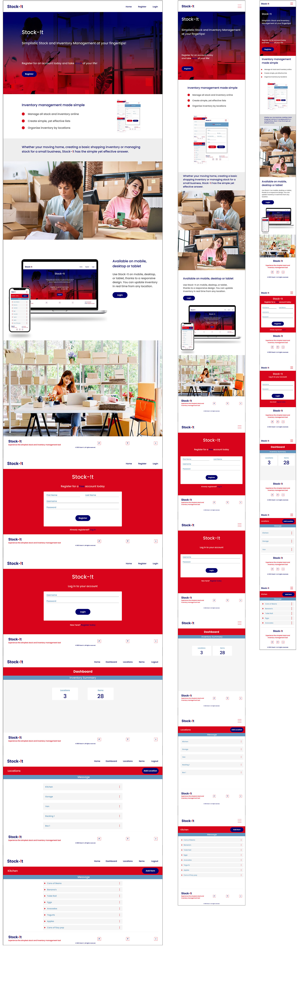

### **Surface**

**Colour**

The colours were chosen using color-hex.com. A red-blue combination was searched for with this particular palette chosen due to the addition of pastel colours. The pastel colours were always going to be utilised within the actual web application. This was important to have the main selling point of the web application to use the bold branded colours and then for the application to have a softer feel once the user had signed up.

Tints and shades of these colours were found at [maketintsandshade.com](https://maketintsandshades.com/).

Colour Palette

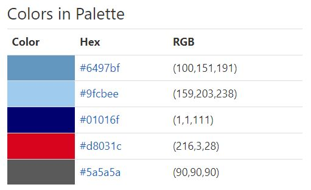

**Typography**

Chosen throughout this site was the font Poppins. It was chosen because of its simple look and very easy to read. It is also a very versatile font that has many font weights. This font is available at [Google Fonts](https://fonts.google.com/).

**Images**

The images within the home page were chosen specifically for there relation to the actual web application. They will have a huge impact as to the selling of the app giving the user a perfect visual as to the use of the application. All the sources where the images came from can be found within the [credits](#credits) section.

**Icons**

The icons within the site can be found at [Font Awesome](https://fontawesome.com/). The main icons within the site are the social media links that can be found on each page in the footer. These give the opportunity for the user to go straight to these social media sites to find out the most recent info regarding the business and the web application. The other icon is the arrow that is used within the items collapsible list.

---

## Features

### **Navigation Bar**

Screenshots

**Desktop**

**Desktop - In Session**

**Mobile**

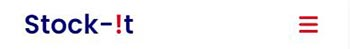

**Mobile - Sidemenu**

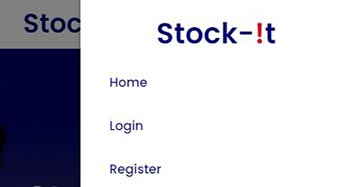

+ Featuring the brand logo to the left which links directly to the home page.

+ The links to the right hand side appear, depending on whether the user is also in session or not. They are hoverable so that when the user is on that link it highlights in grey.

+ The navbar is fixed in order for the user to always gain access to the menu at any point throughout the user navigating the site.

+ On mobile the links will be hidden and instead will be shown once the user clicks on the hamburger symbol and the sidemenu on the right appears.

### **Footer**

Screenshots

**Desktop**

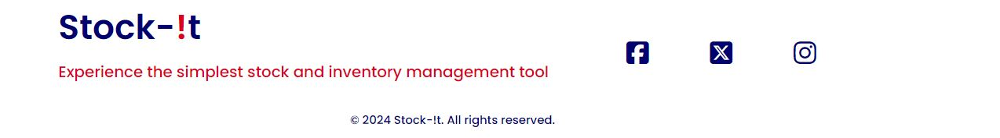

**Mobile**

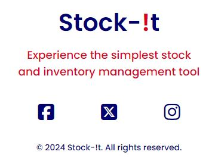

+ Features the brand logo to the left with a strapline below which simplifies what the web application is about.

+ To the right of the footer there are the social media links facebook, X and instagram which once clicked will open in a new window

+ At the centre bottom there is the copyright text.

+ On mobile the footer layout changes, with the elements becoming centralised.

### **Home Page**

This page essentially has been created to advertise and showcase what the web application has to offer, giving the new user the incentive to register for a free account.

#### Jumbotron

Screenshots

**Desktop**

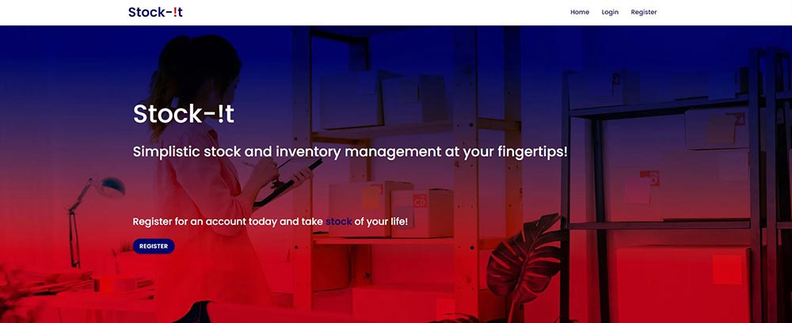

+ The jumbotron is what the user will initially see when they go to the site for the first time. It utilises a full width image that represents how stock-!t can be used and using the branding colours really stands out to the new user.

+ There is the company name big and bold and two straplines that are short and simple that really sums up the application for the new user. These straplines are followed by a button that will take the user to the registration page.

#### Inventory Management

Screenshots

**Desktop**

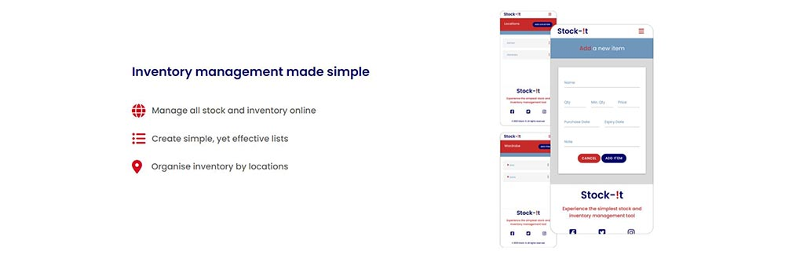

+ In keeping with idea that the home page is for advertising the app, this section shows off the app by giving the user a preview as to the look of the layout from a mobile perspective.

+ On the left side there is a simple big, bold header with three effective straplines below. These straplines have icons before that sum up each strapline.

+ On mobile the image falls below the text and is central, with the text remaining left aligned.

#### Caption

Screenshots

**Desktop**

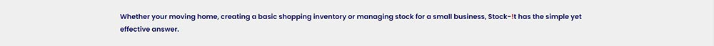

+ This section has a caption that is again not bulky in terms of content but describes perfectly what stock-!t could be used for.

#### Double Pictures

Screenshots

**Desktop**

+ The two pictures following the caption allow the new user to visualise the app being used for the respective reasons that were given in the caption before it. These two images are full width, really making them stand out.

#### Devices

Screenshots

**Desktop**

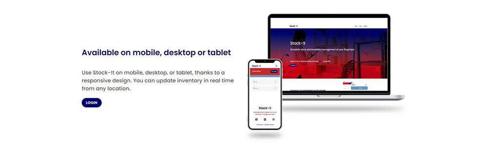

+ This section is in keeping with the first in terms of layout. With an image to the right that again allows the new user to visually see what the web app will look on respective devices.

+ The header to the left tells the user the types of devices and then the paragraph below explains how they are on multiple devices.

+ Below the paragraph, again making sure that the layout is consistent through the build, is a button, this time linking to the login page.

+ On mobile the image falls below the text and is central, with the text remaining left aligned.

#### Single Picture

Screenshots

**Desktop**

+ This last section is a single full width image, that essentially sums up how stock-!t could be used in one of the environments mentioned within the home page.

### **Registeration Page**

Screenshots

**Desktop**

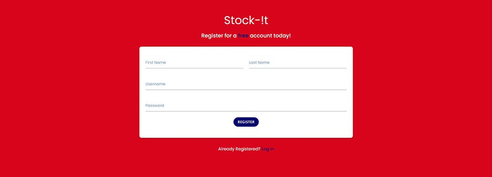

+ The registration page features the text that clearly allows the user to identify that this is the actual register page.

+ The page has a form that allows the user to register. The form consists of a user inputting there first name, last name, username and password. This is followed by a button that allows the user to register.

+ Below the form is text that links the user to the login form, should they have accidentally navigated to the wrong page.

### **Login Page**

Screenshots

**Desktop**

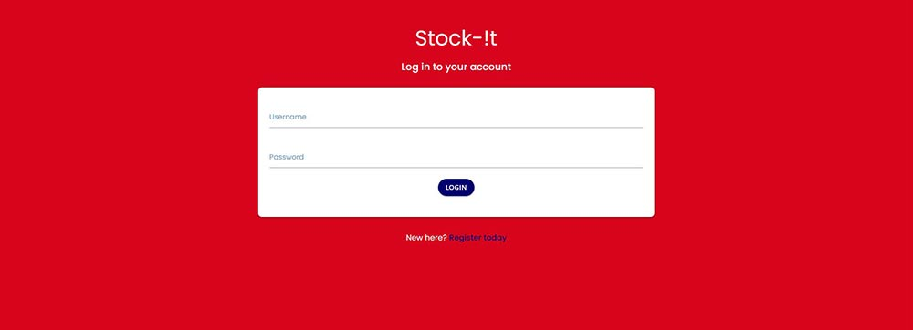

+ The login page features the text that clearly allows the user to identify that this is the actual login page.

+ The page has a form that allows the user to login. The form consists of a user inputting there username and password. This is followed by a button that allows the user to login.

+ Below the form is text that links the user to the registration form, should they have accidentally navigated to the wrong page.

### **Dashboard**

Screenshots

**Desktop**

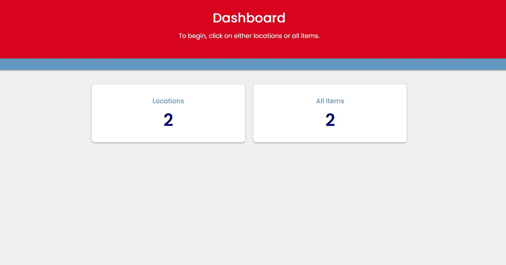

+ The user is firstly presented with a centralised header which tells the user they are in the dashboard page.

+ The light-blue band below is where the user will see flash messages. The message they will see when they login will be personalised to that user, showing "Welcome, {username}".
+ The dashboard contains two card panels, one for locations and one for all items. Both panels show the total of each group. They are also clickable, allowing the user to go straight to that particular page.

### **Locations**

Screenshots

**Desktop**

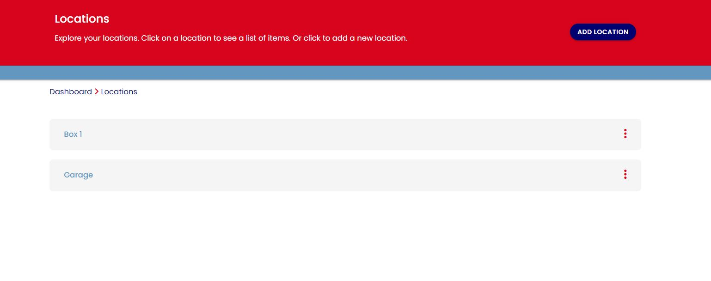

+ Below the header in a red block shows the head "Locations" on the left side. On the right contains a button that when clicked takes the user to the add location page.

+ The light-blue block is where the user will see the flash messages.

+ Below the light-blue section contains the breadcrumbs. These offer the user a great way to navigate from dashboard through to items and back.

+ The locations are shown below the breadcrumbs. To the left of each section block, there is the location name. The section name is clickable, where the user is taken to the items page, where the items shown are all part of that particular location only.

+ To the right of the location block are three vertical dots. These dots once clicked give the user a dropdown that allows them to either edit or delete a location.

### **Add / Edit Location**

Screenshots

**Desktop**

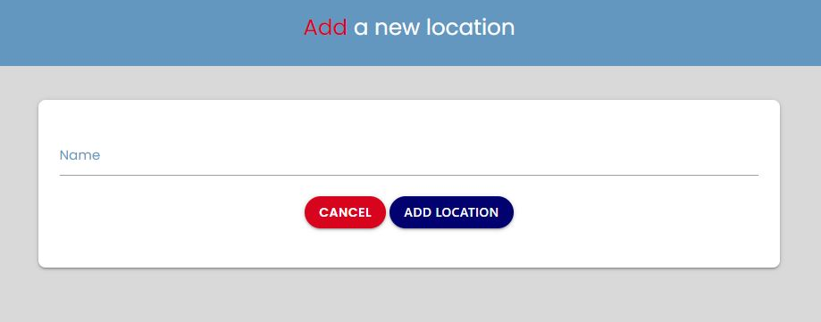

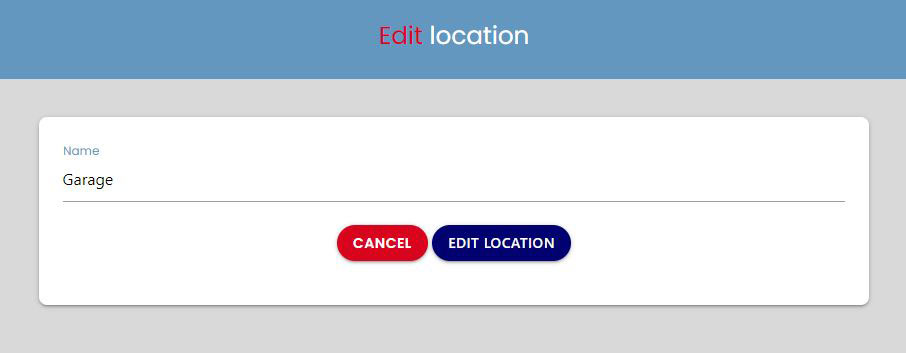

+ When adding / editing a location the user will have a form to fill in. Only the location name is required or can be edited.

+ In the form below the Name input field they have two buttons. One that will cancel, which will take them back to the main locations page. The add location button will do exactly that, add the new location and the user will be taken straight back to the location main page.

### **Delete Location**

Screenshots

**Desktop**

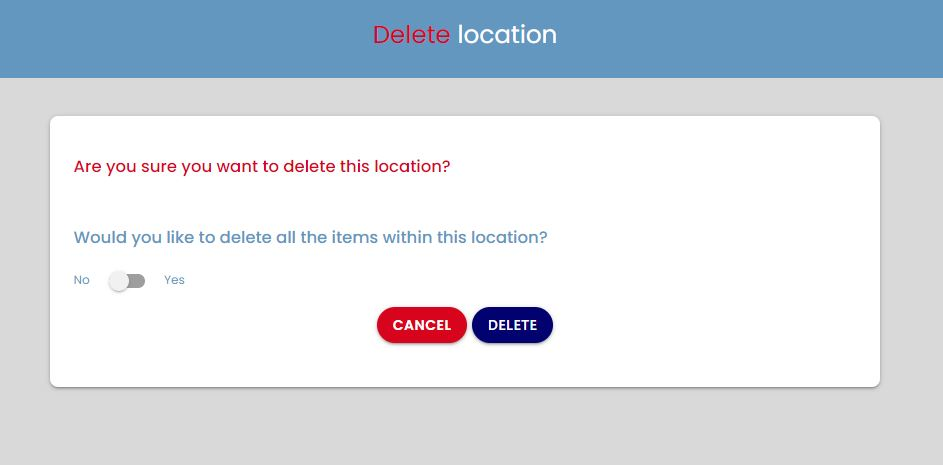

+ When a user deletes a location they will also be taken to a new page, where within a form they will need to confirm whether they would like to actually delete the location in question. As a cool feature they will also be given the option to delete all the items that are assigned to that location.

+ Two buttons will reside below these options. Cancel button will take them back to the main location page. The delete button will also take them back to the location page, however the form will be submitted and that location will no longer be in the list of locations available.

### **Items / All Items**

Screenshots

**Desktop**

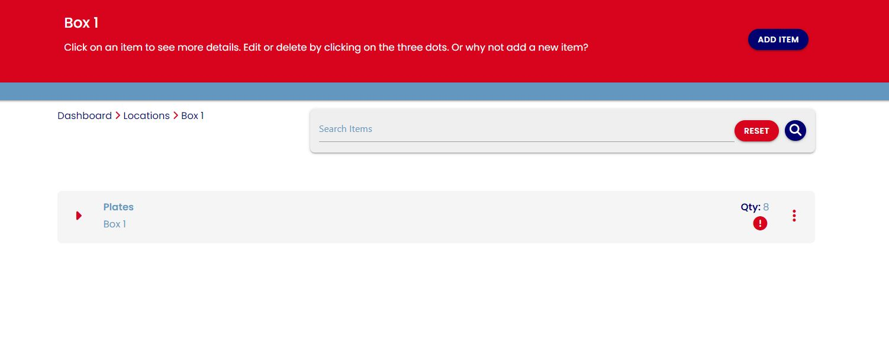

**Desktop - Collapsible**

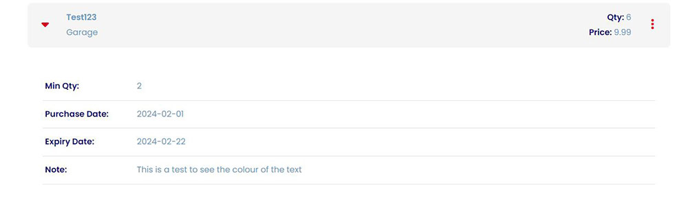

**Mobile**

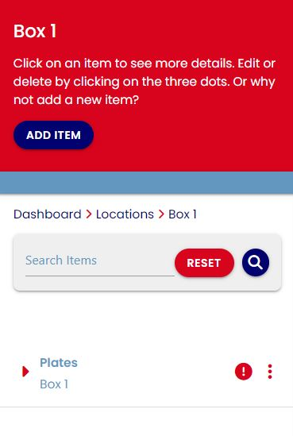

+ The items page can be navigated to in two ways. If you go through the locations, only the items assigned to that location will be listed, whereas if you go to all items through the dashboard or the link in the header, these will show all the items for all locations in alphabetical order by item name.

+ The page will have a similar layout to the locations with a red block after the header section, this will contain on the left a header and then on the right a button for adding a new item.

+ The light-blue block will be below which will contain the flash messages.

+ The search bar will come after the flash messages. This will give user the added bonus of being able to search for items based on there name and the notes field. Should not items exist from the search or not items at all exist within the location then the text "No results could be found" will appear below the bar.

+ The items list has been made up using materializes collapsibles. Each item consists of a carat icon that rotates upon the item being collapsed. Within the collapsible is a table structure that contains the rest of the item fields.

**For desktop:** 
Min Qty, 
Purchase Date, 
Expiry Date, 
Note

**For mobile:**
Qty, 
Min Qty, 
Price, 
Purchase Date, 
Expiry Date, 
Note

+ To the right of each item there is the qty and if applicable a warning icon that states the date has been expired.

+ Just like the location the items also has a vertical three dots dropdown, that allows the user to both edit and delete individual items.

+ On mobile the layout for the items slightly changes. The items list will be full width and due to the available space on a mobile being less, there is no gap between each item. Also due to space, the quantity has been removed and is now showable in the collapsible section.

### **Delete Item**

Screenshots

**Desktop**

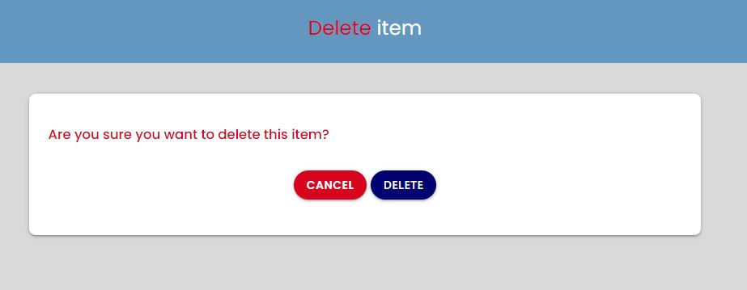

+ Deleting an item took them to a page, which also had a submit form for confirming the deletion of that particular item.

### **Logout**

Screenshots

**Desktop**

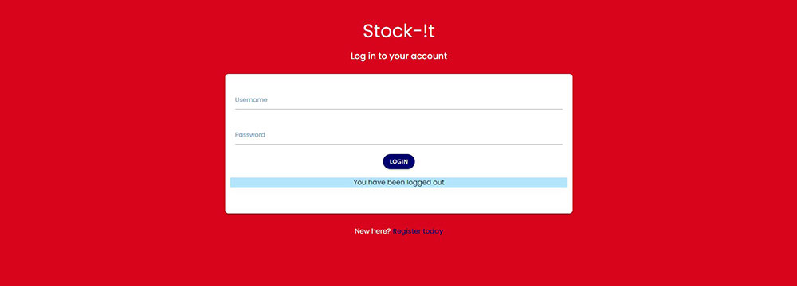

+ When the user wants to log out, they will need to click the link in the header. This will then remove the users session and take them to the login page. The user will then be redirected to the login page where a flash message at the bottom of the form will state "You have been logged out".

---

## Future Features

+ To include filtering within the items page.

+ To have users be able to add tags for both locations and items for enhanced filtering.

+ To include a settings page that will allow the user to change certain units for pricing and the like.

---

## Database Design and Creation

### **Data Model**

Screenshots

**Data Model**

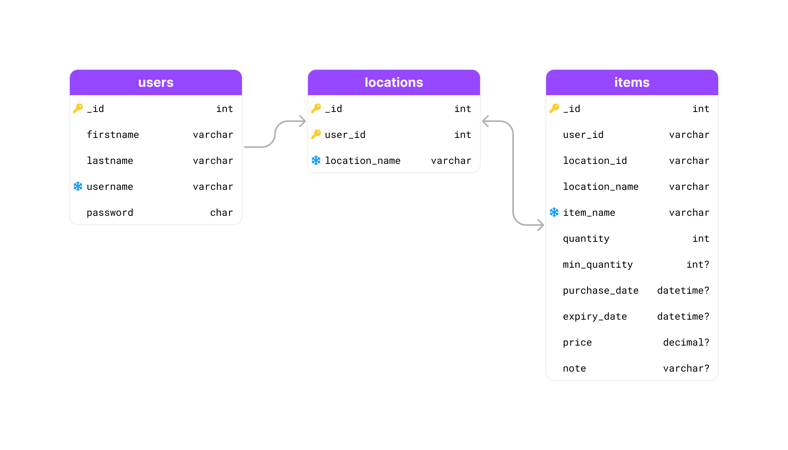

+ Before creating the database a data model was created to help with the design.

### **Database**

Screenshots

**Overview**

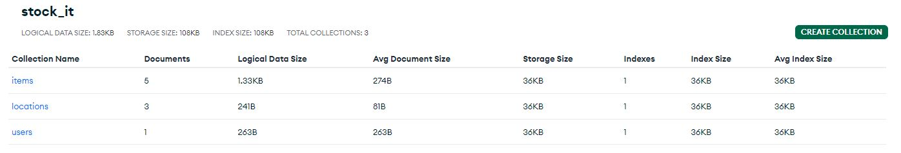

**Users**

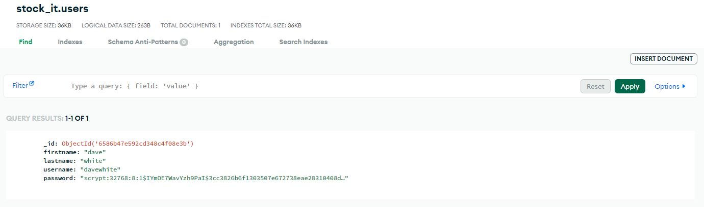

**Locations**

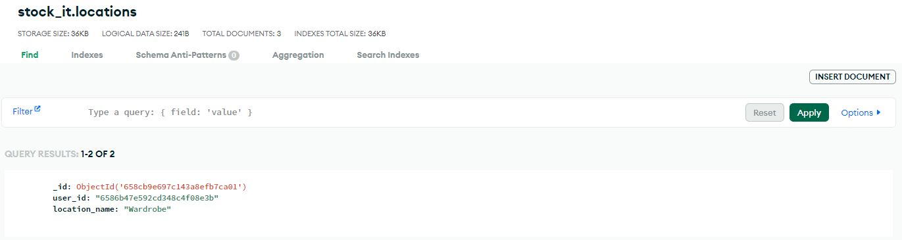

**Items**

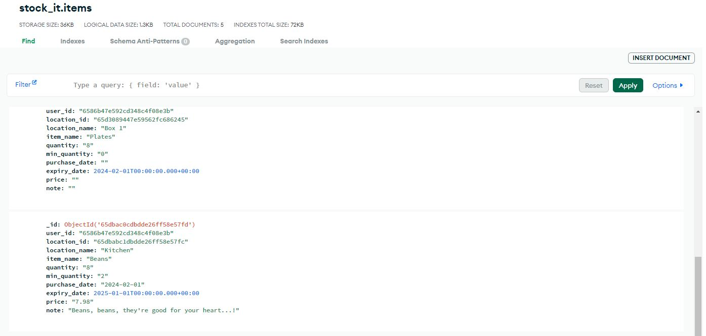

+ The actual database was then created using MongoDB.

---

## Technologies Used

### **Languages**

+ [HTML5](https://en.wikipedia.org/wiki/HTML5)
+ [CSS3](https://en.wikipedia.org/wiki/CSS)
+ [Javascript](https://en.wikipedia.org/wiki/JavaScript)
+ [Python](https://en.wikipedia.org/wiki/Python_(programming_language))

### **Frameworks & Libraries**

+ [MongoDB](https://www.mongodb.com/)
    + used to create the non-relational database for the project.
+ [Heroku](https://heroku.com/)
    + used to deploy the full project.
+ [Flask](https://flask.palletsprojects.com/en/3.0.x/)
    + used to add logic to the html templates alongside python.
+ [jinja](https://jinja.palletsprojects.com/en/3.0.x/)
    + used to add logic to the html templates alongside python.
+ [jQuery](https://jquery.com/)
    + used to add functionality to some of the Materialize CSS Components.
+ [Materialize](https://materializecss.com/)
    + used to create the structure and layout of the website, making it responsive on all devices.
+ [Google Fonts](https://fonts.google.com/)
    + used to get the links to the fonts that are put in the head of the html pages. These fonts are then used throughout the web application.
+ [Font Awesome](https://fontawesome.com/)
    + this was used to add icons to the project.
+ [Git](https://git-scm.com/)
    + was used for version control in order to add, commit and push from GitPod to GitHub.
+ [GitHub](https://github.com/)
    + is used as a repository and to host the full project.
+ [GitPod](https://www.gitpod.io/)
    + is the IDE that is used to develop the web application.

### **Programs**

+ [Adobe Photoshop](https://www.adobe.com/uk/products/photoshop.html)
    + is used to alter and resize all the images that are used within the project.

### **Websites**

+ [Vecteezy](https://www.vecteezy.com/)
    + this site was used to source the images used within the web application.
+ [Free Pik](https://www.freepik.com)
    + this site was used to source the images used within the web application.
+ [Convertio](https://convertio.co/)
    + this site was used to convert the images from png to webp.
+ [Figma](https://www.figma.com/)
    + used to create the wireframes and design layout for the project.
+ [Favicon](https://favicon.io/)
    + used to create the favicon for the web application.
+ [Am I Responsive?](https://ui.dev/amiresponsive)
    + used to create the responsive mock-up image that is at the beginning of the readme file.
+ [Chrome DevTools](https://developer.chrome.com/docs/devtools/)
    + this was used throughout the whole project, from creating the site, testing the responsiveness of the site and then testing the performance.
+ [W3C CSS Validation Service](https://jigsaw.w3.org/css-validator/)
    + this site is used to validate the css which was used to style the web application.
+ [W3C HTML Validation Service](https://validator.w3.org/)
    + used to validate the html for the project.
+ [jsHint](https://jshint.com/)
    + used to validate the javascript for the project.
+ [Stack Overflow](https://stackoverflow.com/)
    + was used for seeking out answers and general learning purposes.