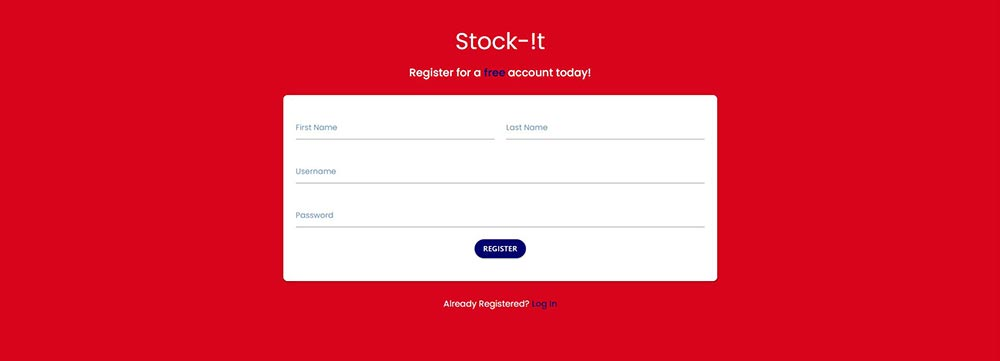
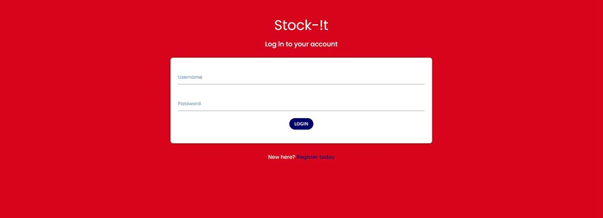
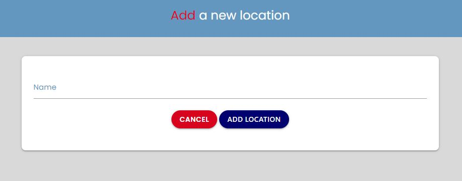
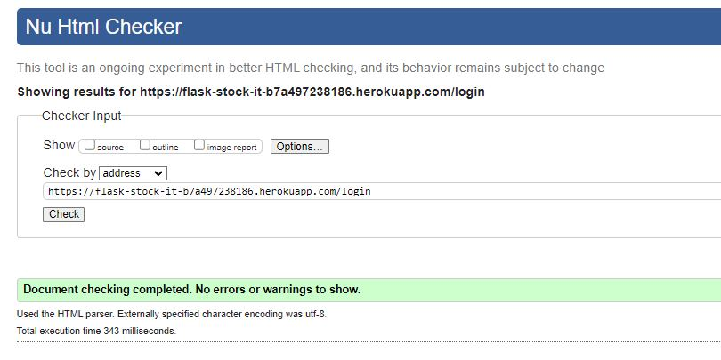
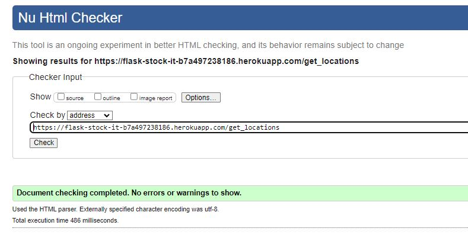

# Testing

---

## User Stories

### **As a First-time User:**

**I want to clearly understand the purpose of the site, when arriving at the home page**

Screenshots

+ When a user first visits the site, they will be presented with an eye catching full width jumbotron with a combination of an image and text. The text clearly and simply explains what the web application is and allows them to register for an account from the off with the use of a button that takes them to the registration page. The image works really well with the text, letting the user see how they might best use the web application.

**I want the website to be responsive so it can be used on any device**

Screenshots

**Desktop**

**Mobile**

+ The website has been made responsive with the use of the materialize library which incorporates the use of the grid system.

**I want the registration process to be smooth and easy**

Screenshots

+ The registration page has been created with an easy to follow and understand form. The registration page can be navigated to by the navbar which is aaccessible when a user is not in session. The user will also be able to navigate via the home page via the jumbotron.

### **As a Returning User:**

**I want to easily login to my account**

Screenshots

+ The returning user can easily login by going straight to the navbar and clicking on 'login'. There is also a button on the home page for the user to click. The user will then be taken to the login page where they will see a basic looking form requiring them to submit there username and password to login.

**I want to be able to create, edit and delete locations**

Screenshots

**Location Page**

**Create**

**Edit**

**Delete**

+ When the user logs in they will be taken to there own dashboard. From here they can click on the Locations panel where they will be taken to the page which will list all of the users locations. Within the location page the user will have the 'add location' button which will take the user to the add location page. This page will allow the user to input the location name and then submit the form.

+ To edit the locations the user will click on the three dots and within the dropdown, select edit. This will take the user to the edit location page, where the user can edit the location name and then submit the form. If they didn't want to edit they can cancel, which will not submit any changes and take them back to the location page instead.

+ Deleting the location is done in a similar way to editing, whereby the user will select delete from the dropdown instead. The delete location page will then instruct the user, asking them to confirm there deletion of the location. They will also be given the option to delete all the items within the location at the same time, potentially saving the user time, rather than deleting each item one by one.

**I want to be able to create, edit and delete stock lists**

Screenshots

**Items Page**

**Create**

**Edit**

**Delete**

+ When the user logs in they will be taken to there own dashboard. From here they can click on the All Items panel where they will be taken to the page which will list all of the users items. They also have the option to click on the location panel, then click on a location of choice. In the chosen location will then show only the items assigned to that specific location. Within the item page the user will have the 'add item' button which will take the user to the add location page. This page will allow the user to input the Location, Item Name, Quantity, Minimum Quantity, Price, Purchase Date, Expiry Date and Note.

+ To edit the items the user will click on the three dots and within the dropdown, select edit. This will take the user to the edit item page, where the user can edit the input fields, Location, Item Name, Quantity, Minimum Quantity, Price, Purchase Date, Expiry Date and Note. These will be pre-populated with the current data that the user inputted when first adding the item. They can then submit the form. If they didn't want to edit they can cancel, which will not submit any changes and take them back to the location page instead.

+ Deleting the item is done in a similar way to editing, whereby the user will select delete from the dropdown instead. The delete item page will then instruct the user, asking them to confirm there deletion of the item.

**I want to be able to access the website from any device**

Screenshots

**Desktop**

**Mobile**

+ The site has been created with a responsive design to allow the user to access the web application from desktop, tablet and mobile devices.

### **As a Business Owner:**

**I want the user to be able to see only there stock lists when they are logged in**

Screenshots

+ The design of the web application in terms of both the logic within the app and the design of the database has allowed for the current user seeing only the items assigned to them. This has been done by getting a list of items from the database which has the field user_id that equals the user in session.

**I want to create a website that looks aesthetically pleasing on any device**

Screenshots

+ Aesthetically the look of the website has been given a modern feel, with a colour range that compliments this look. The styling of the home page has been done in a way that engages the user on first approach and markets the web application perfectly. When logged in, the changing in the colour tones, having a softer look and feel.

**I want the user to experience a smooth and easy process when creating, editing or deleting both locations and stock lists**

Screenshots

**Create Locations**

**Edit Items**

**Delete Items**

+ The process for the whole CRUD functionality within the web application for both locations and items has been done in an easy way for the user to follow. With text on each page, giving the user simple instructions to follow, they can navigate through all CRUD funtionality seamlessly.

---

## Code Validation

### HTML

The HTML was tested using the validation site [W3C HTML Validation Service](https://validator.w3.org/). No errors were found.

Home

Register

Login

Dashboard

Locations

Locations - Add

Locations - Edit

Locations - Delete

Items - Add

Items - Edit

Items - Delete

### CSS

The CSS was tested using the validation site [W3C CSS Validation Service](https://jigsaw.w3.org/css-validator/). No errors were found.

Custom CSS

### Javascript

The Javascript was tested using the validation site [JSHint](https://jshint.com/). No errors were found.

Custom Javascript

---

## Colour Contrast Validation

The Site was tested using the [a11y Color Contrast Accessibility Validator](https://color.a11y.com/). No errors were found.

Color Contrast

---

## Performance

The Site was tested for Performance, Accessibility, Best Practices and SEO, using the Lighthouse Report in the Google Developer Tools.

Desktop

In desktop mode the report clearly shows that the results are of a high percentage and no action was taken to boost any of the four categories.

Mobile

For mobile the performance slightly dipped below 90. Having reviewed this and looked at the performance on a mobile device, the score was found not to be of any concern, as the perfomrnace was high on all devices tested on.

---

## Responsiveness

#### Live

The website was tested on the following live devices:
+ **iiyama desktop monitor - 1920x1080 resolution**
    + the site performed well on a desktop, running smoothly throughout.
+ **Google Pixel 7**
    + the site was tested thoroughly on this mobile device. The site is smooth and responsive throughout on both orientations. There was a slight issue with the jumbotron text in landscape mode (for details please click [here](#site---landscape-mode)).
+ **Amazon Fire Tablet HD**
    + the site was tested on this tablet and worked very well. Responsive, looked good in both orientations and was smooth thoughout navigation.
+ **iPhone 11**
    + the site navigated and looked good on an iphone. There was no issues to note.

#### Simulation

The site was also tested using Chrome Developer Tools on the following setups:
+ iPhone SE
+ iPhone XR
+ iPhone 12 Pro
+ Pixel 5
+ Samsung Galaxy S8+
+ Samsung Galazy S20 Ultra
+ Galaxy Fold
+ Samsung Galaxy A51/71
+ iPad Air
+ iPad Mini
+ Surface Pro 7
+ Surface Duo
+ Nest Hub
+ Nest Hub Max

The site performed as expected and was responsive, with all functionality and navigation working well.